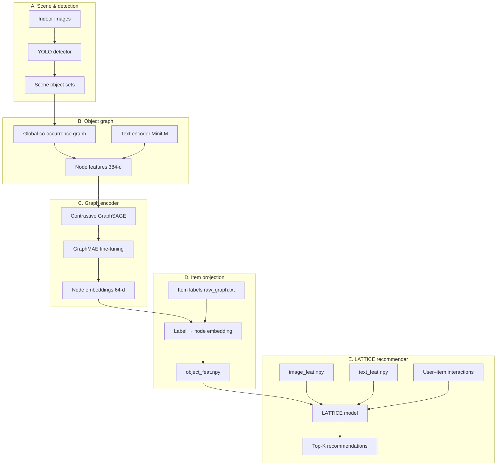

# Object-Graph Multimodal Recommender — Architecture

Research-oriented description of each layer, from scene images to LATTICE recommendations. Implementation lives in `ObjectGraph/` and `Models.py`.

---

## 1. System overview

The system adds an **object-graph modality** to a multimodal item recommender (LATTICE). Each product is represented by three feature vectors: **image**, **text**, and **graph** (object context). Graph features encode *which object* the product is and *how that object relates to others* in indoor scenes.



**Reference:** GraphMAE — Hou et al., *GraphMAE: Self-Supervised Masked Graph Autoencoders*, KDD 2022. [arXiv:2205.10803](https://arxiv.org/abs/2205.10803)

---

## 2. Layer A — Scene acquisition and object detection

| Item | Description |
|------|-------------|
| **Input** | RGB indoor images (e.g. NYU Depth v2, MIT Indoor; see `data/NYU-Depth/`, `data/mit-indoors/`) |
| **Detector** | YOLO26-X (`yolo26x` / `assets/yolo26x.pt`) — class labels per bounding box |
| **Output** | `data/scenes.json` — `[[ "Mirror", "Sink", ... ], ...]` (NYU Depth format) |
| **Optional** | `data/benchmark_results.json` — per-image YOLO raw labels |

**Formal scene definition.** For image \(s\):

\[
O_s = \{ o_1, o_2, \ldots, o_n \}
\]

Only scenes with \(|O_s| \geq 2\) are kept so co-occurrence edges exist.

**Code:** `data/prepare-objectgraph/` (download MIT Indoor, filter **home** room categories, YOLO → `scenes.json`), `graph_data.load_scenes()`.

---

## 3. Layer B — Graph construction

All scenes are merged into one **global object graph** \(G = (V, E)\).

| Symbol | Meaning |
|--------|---------|
| \(V\) | Unique object categories (nodes), e.g. `Chair`, `Sink` |
| \(E\) | Undirected edges: \((i,j)\) if two objects co-occur in some scene |
| \(\mathbf{x}_i \in \mathbb{R}^{384}\) | Initial node feature = MiniLM embedding of label \(i\) |

**Construction algorithm**

1. Collect all labels from all scenes → \(V\)
2. For each scene, add edges between every pair in \(O_s\) (combinations of size 2)

**Properties**

- Sparse, interpretable structure (semantic co-occurrence, not pixel similarity)
- Extensible with more indoor datasets (see `docs/improvments.md`)

**Code:** `graph_data.build_graph()`, `graph_data.load_graph_data()`.

---

## 4. Layer C — Graph encoder training

Two-stage self-supervised learning on \(G\). Both stages share a **2-layer GraphSAGE** backbone (`encoder.py`).

### 4.1 Stage 1 — Contrastive pre-training (optional but recommended)

**Goal:** Pull embeddings of linked objects together; push random non-edges apart.

| Hyperparameter | Default | Measured |
|----------------|---------|----------|
| Hidden dim | 64 | Insensitive from 16 to 256 (≤0.002 AUC spread). Kept at 64 to match LATTICE `feat_embed_dim`. |
| Temperature \(\tau\) | 0.5 | **Sub-optimal.** τ=0.2 is best; τ≤0.1 overfits badly (train 0.90 / test 0.78). |
| Optimizer | Adam, lr \(10^{-3}\) | Near-optimal; flat from 3·10⁻⁴ to 3·10⁻³, degrades above. |
| Epochs | 20 | **Sub-optimal.** Converges near epoch 100; 20 epochs costs ~0.035 AUC. |

These defaults were inherited, not selected. The "Measured" column comes from the sensitivity
study in [../../docs/paper-code-audit.md](../../docs/paper-code-audit.md); run it with
`scripts/sweep_objectgraph.py`. Numbers are held-out link-prediction AUC against
degree-matched negatives, mean over 3–5 seeds (seed std ≈ 0.003).

**Loss.** For positive edge \((i,j)\) and sampled negative \((i',j')\):

\[
\mathcal{L}_{\text{con}} = \text{BCE}\big( \text{sim}(\mathbf{z}_i, \mathbf{z}_j)/\tau,\; 1 \big) + \text{BCE}\big( \text{sim}(\mathbf{z}_{i'}, \mathbf{z}_{j'})/\tau,\; 0 \big)
\]

**Output:** `data/graph-embeddings/v2/graphsage_model_v2.pt`

**Code:** `core.train()`

### 4.2 Stage 2 — GraphMAE fine-tuning

**Goal:** Reconstruct masked node features so the encoder captures higher-order structure beyond pairwise contrast (GraphMAE, KDD 2022).

| Component | Role |
|-----------|------|
| **Masking** | Random fraction `mask_rate` (default 0.75) of nodes; features replaced with learnable mask token (+ optional noise replacement) |
| **Encoder** | GraphSAGE → \(\mathbf{h}_i \in \mathbb{R}^{64}\) |
| **Decoder** | Linear map \(\mathbb{R}^{64} \to \mathbb{R}^{384}\) on encoder output |
| **Loss** | Scaled cosine error (SCE) on **masked nodes only** |
| **Re-mask** | `remask` (default **False**). GraphMAE zeroes the masked latents again before decoding, which requires a *GNN* decoder that can recover them from neighbours. Against this linear decoder the loss input becomes `decoder(0)` — the bias — so **every encoder gradient is exactly zero**. The original code did this unconditionally, making Stage 2 a no-op on the encoder; `remask=True` reproduces it for audit. |

**SCE loss** (GraphMAE default, \(\alpha = 3\)):

\[
\mathcal{L}_{\text{SCE}} = \frac{1}{|\mathcal{M}|} \sum_{i \in \mathcal{M}} \left( 1 - \frac{\hat{\mathbf{x}}_i^\top \mathbf{x}_i}{\|\hat{\mathbf{x}}_i\| \|\mathbf{x}_i\|} \right)^\alpha
\]

where \(\mathcal{M}\) = masked nodes, \(\mathbf{x}_i\) = original MiniLM features, \(\hat{\mathbf{x}}_i\) = decoder prediction.

| Hyperparameter | Default |
|----------------|---------|
| `mask_rate` | 0.75 |
| `mae_alpha` | 3.0 |
| `replace_rate` | 0.1 |
| `mae_epochs` | 100 |
| `mae_lr` | \(10^{-3}\) |
| **Init** | Encoder weights loaded from Stage 1 checkpoint when `init_from` is set |

**Measured:** with the gradient repaired, Stage 2 *lowers* held-out co-occurrence AUC from
0.790 ± 0.003 to 0.752 ± 0.014 at every `mask_rate` (0.25–0.9), `mae_epochs` (100–3000) and
`mae_alpha` (1–5) tested, and removes the entire gain of the tuned configuration
(0.824 → 0.754). Reconstructing each node's own MiniLM embedding pulls the representation back
toward the text modality the object graph is meant to complement. **Use Stage 1 alone**; see
`docs/tables/stage_ablation.tex`.

**Inference embeddings:** Full graph, no mask → encoder → L2-normalize → \(\mathbf{z}_i \in \mathbb{R}^{64}\).

**Output:** `data/graph-embeddings/v2/graphmae_model_v2.pt`

**Code:** `graphmae.GraphMAE`, `core.train_mae()`, `core.train_full()` (Stage 1 + 2).

### 4.3 Why two stages?

| Stage | Inductive bias |
|-------|----------------|
| Contrastive | Local: neighbors in scenes should be similar |
| GraphMAE | Global: entire feature vector of a node predictable from neighborhood context |

Together they align with the paper pipeline: contrastive link prediction + generative feature reconstruction (GraphMAE improves over GAE by masking and SCE).

---

## 5. Layer D — Item feature projection

E-commerce items are not graph nodes; each item has an **object label** (one per line in `5-core/raw_graph.txt`).

| Step | Rule |
|------|------|
| 1 | If label matches a graph node (case-insensitive) → use that node’s 64-d embedding |
| 2 | Else → MiniLM encode label, nearest graph node by cosine similarity |

**Output:** `object_feat.npy` with shape `(n_items, 64)` — consumed by LATTICE as `graph_feats`.

**Code:** `core.build_object_feat()`

---

## 6. Layer E — LATTICE integration

| Modality | File | Role in LATTICE |
|----------|------|-----------------|
| Image | `image_feat.npy` | Visual item similarity graph |
| Text | `text_feat.npy` | Textual item similarity graph |
| Graph | `object_feat.npy` | Object-context item similarity graph |

**`Models.py` (LATTICE):**

1. Embeddings from pretrained features (`nn.Embedding.from_pretrained`)
2. Per-modality KNN graphs + normalized Laplacian
3. Learnable fusion weights over image / text / graph
4. Graph propagation + collaborative filtering (MF / NGCF / LightGCN)

Object-graph features enter the same pathway as image and text after linear projection to `feat_embed_dim`.

**Entry point:** `main.py`, `scripts/run_lattice.sh`

---

## 7. Module map

| File | Layer | Responsibility |
|------|-------|----------------|
| `config.py` | — | Paths, hyperparameters |
| `graph_data.py` | B | Scenes, graph build, MiniLM node init |
| `encoder.py` | C | GraphSAGE backbone |
| `graphmae.py` | C | Masked AE + SCE + fine-tuning |
| `core.py` | C, D | Training orchestration, `object_feat` export |
| `docs/ARCHITECTURE.md` | — | This document |

---

## 8. Training commands (research reproducibility)

```python
from ObjectGraph import train, train_mae, train_full, build_object_feat

# Stage 1 only
train()

# Stage 2 only (GraphMAE; optionally warm-start)
train_mae(cfg={"init_from": "data/graph-embeddings/v2/graphsage_model_v2.pt"})

# Recommended: contrastive → GraphMAE
train_full()

# Export for LATTICE
build_object_feat("home_v2-2")
```

Custom config example:

```python
train_full(cfg={
    "epochs": 20,
    "mae_epochs": 150,
    "mask_rate": 0.75,
    "mae_alpha": 3.0,
    "hidden_dim": 64,
})
```

---

## 9. Artifacts checklist

| Artifact | Produced by |
|----------|-------------|
| `benchmark_results.json` | YOLO on scene images |
| `graphsage_model_v2.pt` | `train()` |
| `graphmae_model_v2.pt` | `train_mae()` / `train_full()` |
| `raw_graph.txt` | Product title → object label (Home_Kitchen pipeline) |
| `object_feat.npy` | `build_object_feat()` |

---

## 10. Suggested thesis / report wording

> We construct a global object co-occurrence graph from indoor scene detections. Nodes are initialized with sentence embeddings and encoded with a two-layer GraphSAGE network. The encoder is first trained with a contrastive edge objective, then fine-tuned with GraphMAE masked feature reconstruction and scaled cosine error. The resulting 64-dimensional node embeddings are mapped to catalog items via object labels and fed into LATTICE as a third modality alongside image and text features.

---

## 11. Related project docs

- `docs/Introduction.md` — graph construction narrative (Section 3.1)
- `docs/data_fusion.md` — modality fusion in LATTICE
- `docs/evaluation.md` — benchmark configurations
- `ObjectGraph/README.md` — quick start
